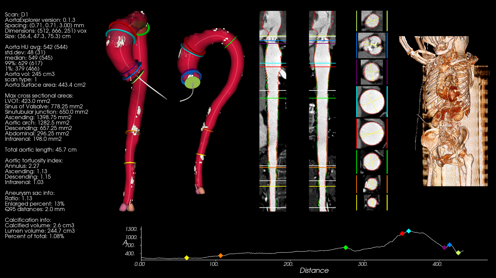
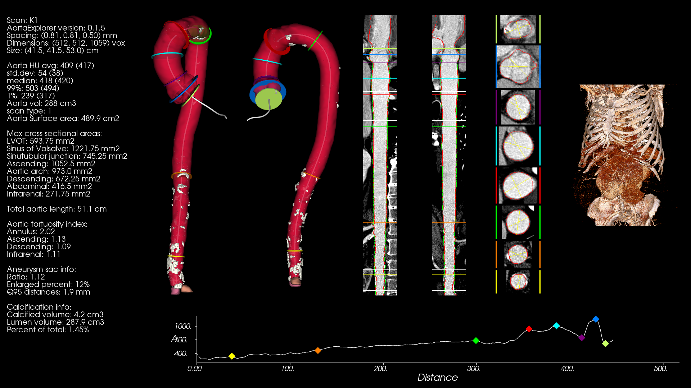
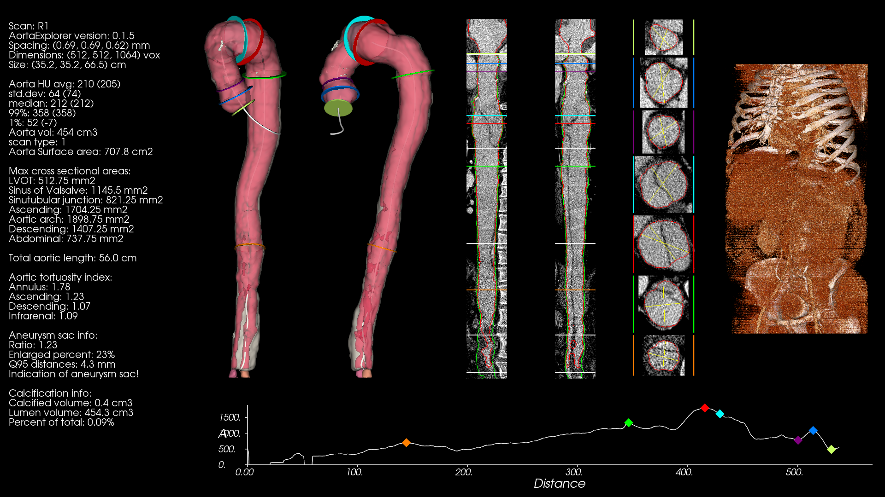

# AortaExplorer results on the Aortic Vessel Tree (AVT) CTA Datasets

[The Aortic Vessel Tree (AVT) CTA Datasets](https://figshare.com/articles/dataset/Aortic_Vessel_Tree_AVT_CTA_Datasets_and_Segmentations/14806362) 
 is a dataset including 56 CTA scans from mostly healthy aortas, covering the aortic arch and its branches and the abdominal aortas with the iliac arteries. The dataset also includes a mask including the aorta and its branches. It is described in [this article](https://www.sciencedirect.com/science/article/pii/S2352340922000130).

The dataset consists of three named subsets:
- Dongyang: 18 scans
- Kits: 20 scans. In these scans the original Hounsfield Units seems to be shifted with an offset of 1024.
- Rider: 18 scans.  In these scans the original Hounsfield Units seems to be shifted with an offset of 1024.

The scans are stored as NRRD files. AortaExplorer converts NRRD to NIFTI files before processing.

To process the dataset, there are several ways to do this. The Dongyang scans should be processed seperately from the Kits and Rider dataset, since the Kits and Rider sets need to have an offset subtracted from their HU values.

## Dongyang

- Copy all NRRD files to a single folder (for example `/data/AVT-Dongyang/images/`)
- Delete the `*seg.nrrd` files

Then AortaExplorer can be called:

```bash
AortaExplorer -i /data/AVT-Dongyang/images/ -o /data/AVT-Dongyang/AortaExplorerOutput/ --verbose
```

## Kits and Rider

- Copy all NRRD files to a single folder (for example `/data/AVT-KitsRider/images/`)
- Delete the `*seg.nrrd` files

Then AortaExplorer can be called:

```bash
AortaExplorer -i /data/AVT-KitsRider/images/ -o /data/AVT-KitsRider/AortaExplorerOutput/ -huo -1024 --verbose
```

The parameter `-huo -1024` will subtract a value of 1024 from all voxels values and bringing the Hounsfield units into the normal calibrated range.


## Results on the Aortic Vessel Tree (AVT) CTA Datasets

The ground truth segmentations provided in the AVT dataset includes both the aorta and the aortic branches. The segmentation from AortaExplorer only includes the aorta from the iliac arteries to the end of the aortic annulus. The segmentation masks will therefore only overlap in the true aorta part and that will influence a DICE score.


### Dongyang

AortaExplorer succesfully analyse **18** out of **18** scans in the Dongyang dataset. 

For example subject **D1**:



### Kits

AortaExplorer succesfully analyse **18** out of **20** scans in the Kits dataset. 

For example subject **K1**:




### Rider

AortaExplorer succesfully analyse **13** out of **18** scans in the Rider dataset. 

For example subject **R1** that has a abdominal dissection of the aorta. The gray semitransparent surface is the original aorta segmentation computed by [TotalSegmentator](https://github.com/wasserth/TotalSegmentator):



The failed scans are typically due to non-contrast, file reading errors or TotalSegmentator failing to segment inital estimate.
