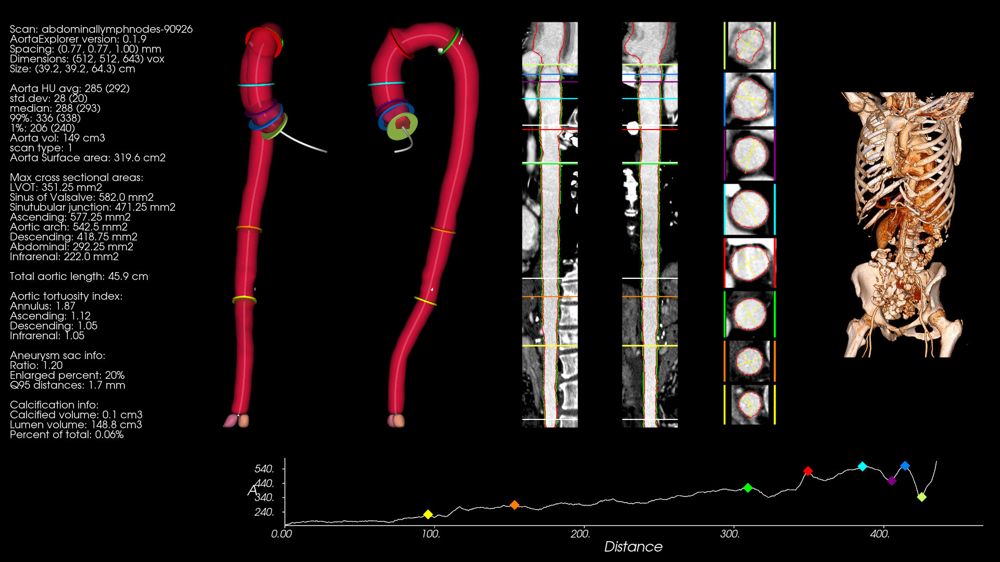
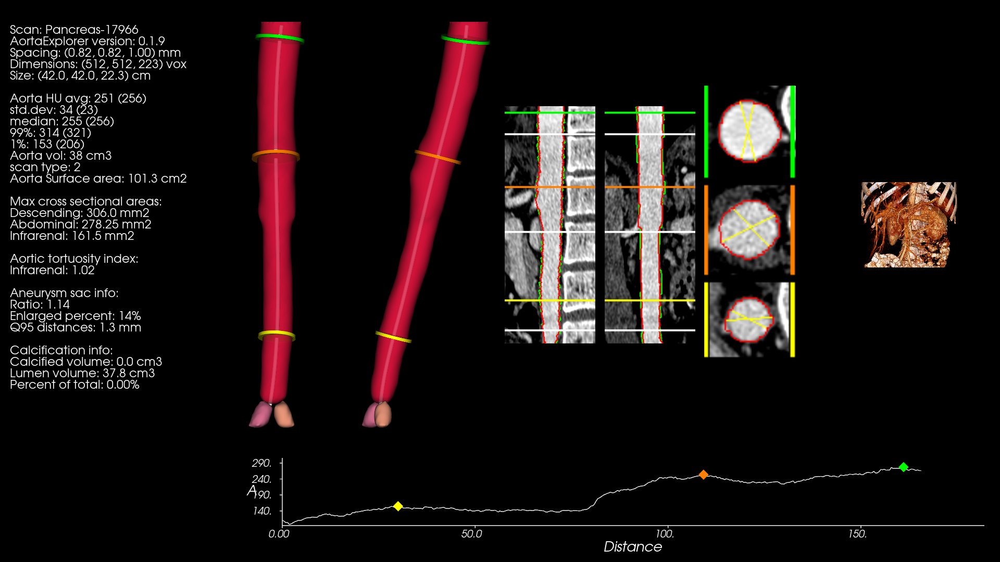
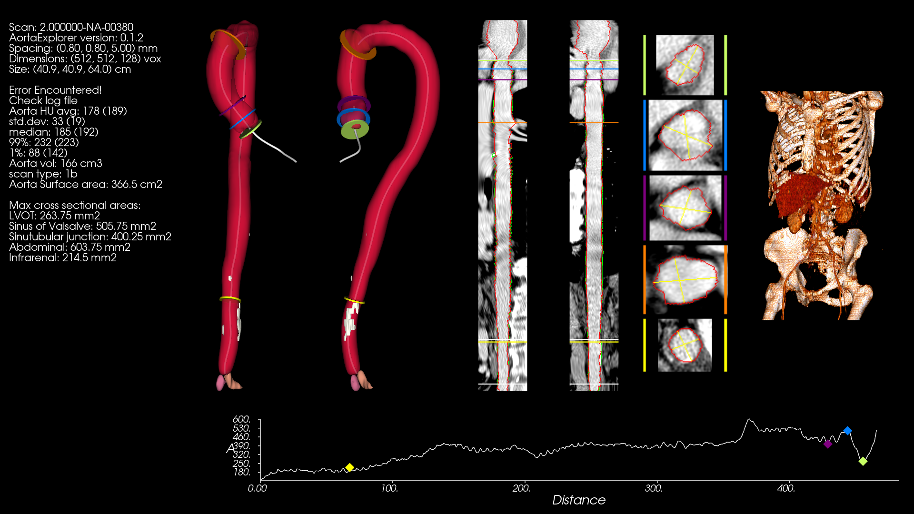

# AortaExplorer results on open full body and abdominal CT data sets

Here it is described how AortaExplorer can be used to process a set of open data sets containing full body or abdominal CT scans.

- [CT lymph nodes](https://www.cancerimagingarchive.net/collection/ct-lymph-nodes/) contains 176 CT scans in DICOM format.
- [Mediastinal-Lymph-Node-SEG](https://www.cancerimagingarchive.net/collection/mediastinal-lymph-node-seg/) contains 513 CT scans in DICOM format.
- [Pancreas CT](https://www.cancerimagingarchive.net/collection/pancreas-ct/) contains 80 CT scans in DICOM format.

## CT lymph nodes

To run AortaExplorer on the [CT lymph nodes](https://www.cancerimagingarchive.net/collection/ct-lymph-nodes/) data set, start by downloading the data.

AortaExplorer can be called by (adapt input and output folder to your setup):

```bash
AortaExplorer -i "/data/CTLymphNodes/manifest-1680277513580/CT Lymph Nodes" -r -o /data/AortaExplorer/output-CTLymphNodes/ -np 8 --verbose -cts
```

where the `-r` options tells AortaExplorer to recursively find all folders contaning relevant input files. In this case, it will find all folders with DICOM files. The DICOM files will initially be converted to NIFTI using [dicom2nifti](https://github.com/icometrix/dicom2nifti).

AortaExplorer generally works well on this data, as can be seen in the output of for example **abdominallymphnodes-90926**:



## Pancreas CT

To run AortaExplorer on the [Pancreas CT](https://www.cancerimagingarchive.net/collection/pancreas-ct/) data set, start by downloading the data.

AortaExplorer can be called by (adapt input and output folder to your setup):

```bash
AortaExplorer -i "/data/Pancreas/manifest-1599750808610/Pancreas-CT/" -r -o /data/AortaExplorer/output-PancreasCT/ -np 8 --verbose -cts
```

AortaExplorer generally works well on this data, as can be seen in the output of for example **Pancreas-17966**:



Some of the scans in the set, has been extended and the voxels has been filled with a default value of *-1024*. This causes issues in the out-of-scan-reconstruction detection. Please always inpaint out-of-scans-voxels with values below or equal to -2048, since air will sometimes have values around -1024.


## Mediastinal-Lymph-Node-SEG

To run AortaExplorer on the [Mediastinal-Lymph-Node-SEG](https://www.cancerimagingarchive.net/collection/mediastinal-lymph-node-seg/) data set, start by downloading the data.

AortaExplorer can be called by (adapt input and output folder to your setup):

```bash
AortaExplorer -i "/data/Mediastinal-Lymph-Node/manifest-1724359862867/Mediastinal-Lymph-Node-SEG/" -r -o /data/AortaExplorer/output-Mediastinal-Lymph-Node-SEG/ -np 8 --verbose -cts
```

It is a very diverse dataset with many different scan field-of-views and voxel spacing. AortaExplorer generally identifies the scans that can be processed and generates meaningfull results even on scans with large voxel spacings as seen here:


