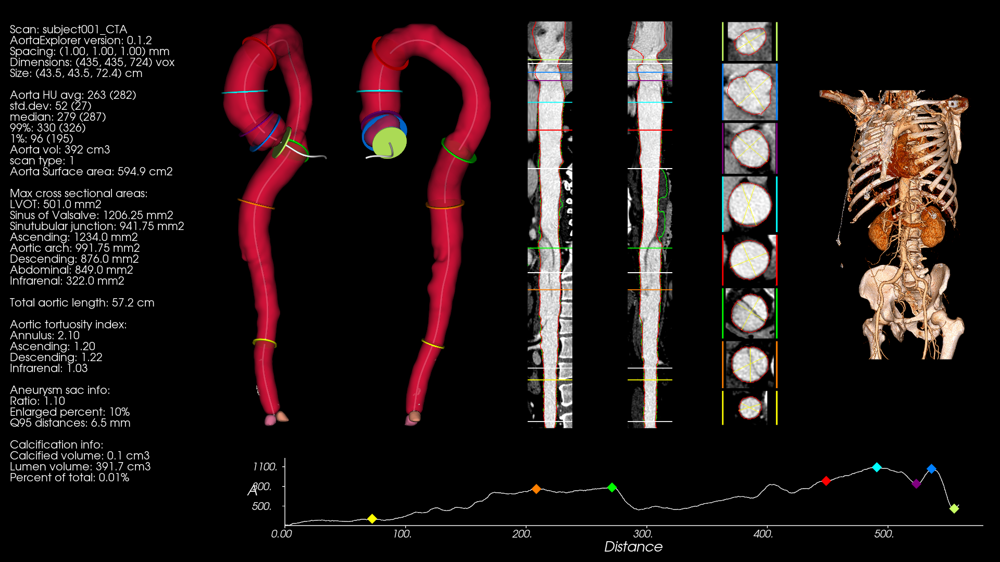
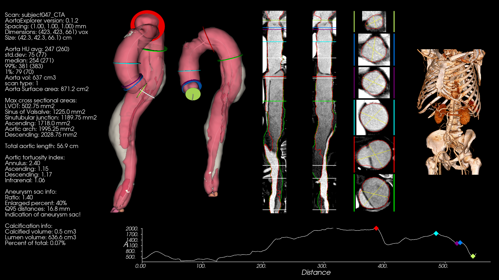
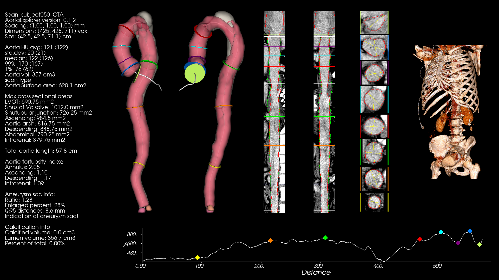
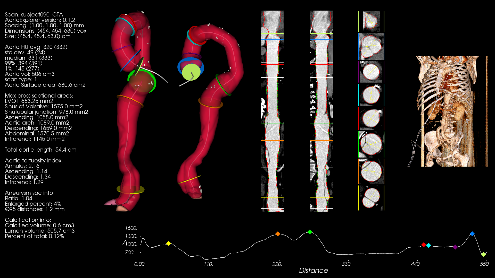

# AortaExplorer results on AortaSeg24

[AortaSeg24](https://aortaseg24.grand-challenge.org/) is a grand-challenge dataset focusing on segmenting the aorta and its branches. The dataset consists of 100 CTA scans with ground truth annotations of aortic zones. The zones are not in direct correspondence with the segments defined by the [European society of cardiology (ESC)](https://pubmed.ncbi.nlm.nih.gov/25173340/) that AortaExplorer uses.

The [AortaSeg24](https://aortaseg24.grand-challenge.org/) scans seems to be taken with patients with moderate to severe type B aortic dissection. At least one of the patients has undergone a Thoracic Endovascular Aortic Repair (TEVAR) where a metal stent has been inserted in the upper part of the aorta (case 011).

While AortaExplorer is not meant as a diagnostic tool for patients with dissections it can still process the scans and give meaningful results and visualizations. 

To use AortaExplorer on the AortaSeg24 dataset, the following command can be used:

```
AortaExplorer -i /data/AortaSeg24/images/ -o /data/AortaSeg24/AortaExplorerOutput/ -nts -cts
```

Where, `/data/AortaSeg24/images/` is the folder where the input CTA scans are placed. The arguments `-nts -cts` tells AortaExplorer not to use the original TotalSegmentator segmentation for the centerline and to include the measurements based on the TotalSegmentator segmentation for comparison. Our experiments shows that AortaExplorer can succesfully compute on 99 of the 100 scans and the failed scan is because TotalSegmentator can not correctly segment a part of the aorta (subject075).

# Commented results on AortaSeg24

The following comments are from a trained radiologist inspecting some of the visualizations produced by AortaExplorer on AortaSeg24.

## AortaSeg24 subject001

The patient has a type B aortic dissection as seen in the curved planar reformatted images and on the cross sections. It is seen as a darker line crossing through the lumen. The lumen is actually split in (at least) two seperate parts.



## AortaSeg24 subject011

The patient has a severe aortic aneurysmic sac and has been treated with a Thoracic Endovascular Aortic Repair (TEVAR) as seen as the metal grid in the image. The red part of the aorta is the pure lumen (contrast enhanced blood) identified by AortaExplorer. The transparent surface is the segmentations found by AortaExplorer that includes an aortic aneurysmic sac (stagnant blood inside a dissection).


## AortaSeg24 subject047

The patient has a severe type B aortic dissection as seen in the curved planar reformatted images and on the cross sections. It is seen as a darker line crossing through the lumen. The red part of the aorta is the pure lumen (contrast enhanced blood) identified by AortaExplorer. The transparent surface is the segmentations found by AortaExplorer that includes an aortic aneurysmic sac (stagnant blood inside a dissection).




## AortaSeg24 subject050

The patient has a aortic dissection at the aortic arch. The red part of the aorta is the pure lumen (contrast enhanced blood) identified by AortaExplorer. The transparent surface is the segmentations found by AortaExplorer that includes an aortic aneurysmic sac (stagnant blood inside a dissection).




## AortaSeg24 subject090

The patient has a severe type B aortic dissection and several aortic aneurysms as seen on the diameter plot. 



