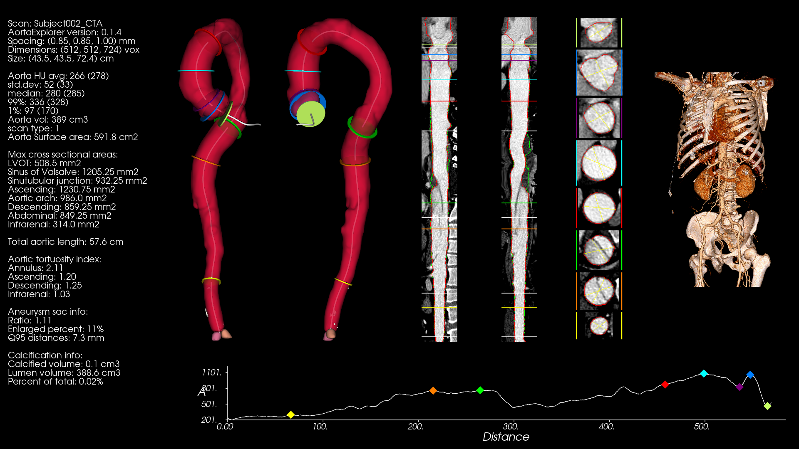
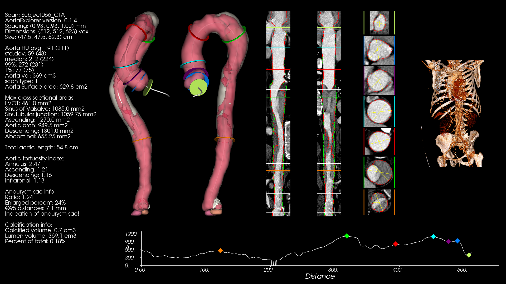

# AortaExplorer results on the CIS-UNet dataset

[The CIS-UNet dataset](https://github.com/mirthAI/CIS-UNet) 
 is a dataset including 59 CTA scans of aortas. The dataset also includes several ground truth masks including the aorta and its branches. It is described in [this article](https://www.sciencedirect.com/science/article/pii/S0895611124001472).

If you use this set, there is a set of [papers that can be referenced](https://github.com/mirthAI/CIS-UNet?tab=readme-ov-file#citations-).

[The CIS-UNet dataset](https://github.com/mirthAI/CIS-UNet)  scans seems to be taken with patients with moderate to severe type B aortic dissection. At least one of the patients has undergone a Thoracic Endovascular Aortic Repair (TEVAR) where a metal stent has been inserted in the upper part of the aorta (Subject_013_CTA). There seems to be a partial overlap with the scans in [AO-AortaSeg24.MD](AortaSeg24).

While AortaExplorer is not meant as a diagnostic tool for patients with dissections it can still process the scans and give meaningful results and visualizations. 

To use AortaExplorer on the CIS-Unet dataset, the following command can be used:

```
AortaExplorer -i /data/CIS_UNet/data/Volumes/ -o /data/CIS_UNet/AortaExplorerOutput/ -nts -cts
```

Where, `/data/CIS_UNet/data/Volumes/` is the folder where the input CTA scans are placed. The arguments `-nts -cts` tells AortaExplorer not to use the original TotalSegmentator segmentation for the centerline and to include the measurements based on the TotalSegmentator segmentation for comparison. 

# Commented results on CIS-Unet data

Our experiments shows that AortaExplorer can succesfully compute on **59** of the **59** scans. We have visually inspected the rendered outputs and they generally looks correct.

## CIS-UNet Subject002_CTA

The result can be seen in the figure below. A dissection can be seen in the aorta.



## CIS-UNet Subject066_CTA

The result can be seen in the figure below. A dissection can be seen in the aorta. There is also a large aneurysmic sac containing a previous blood leak.


