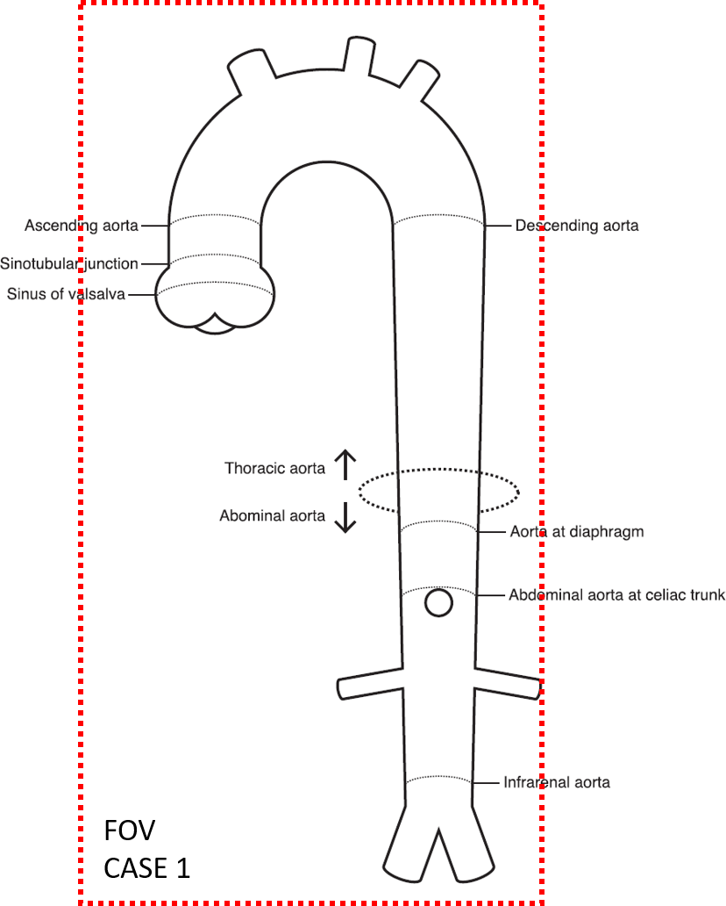
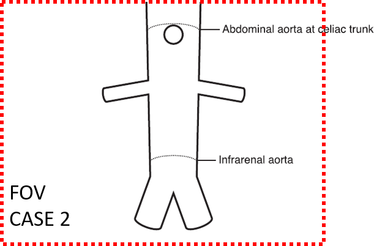
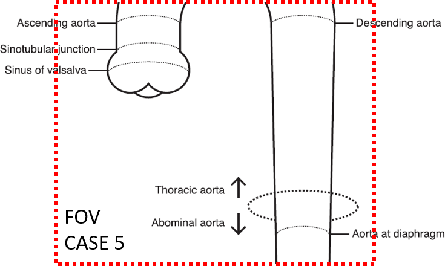

# Scan field-of-view definitions

## FOV CASE 1: Complete aorta

## FOV CASE 2: Typical abdominal scan

## FOV CASE 5: Typical cardiac scan

## Other FOV cases

We are keeping track of other FOV cases and are trying to have them described in [this FOV document](figs/AortaExplorer-FOV-CASES.pdf).
